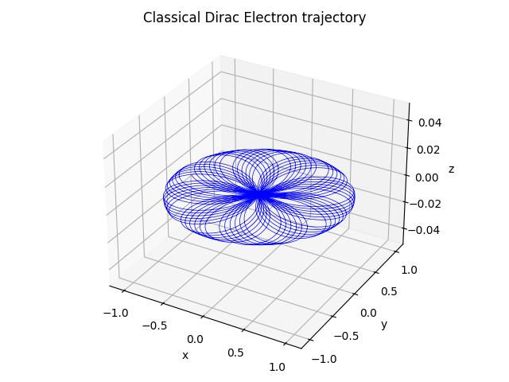
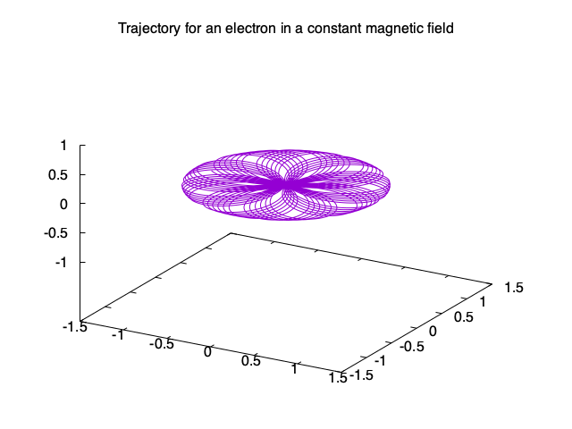

# ClassicalDiracElectron

This project simulates a classical Dirac electron in time, following the
Barut–Zanghi model (Phys. Rev. Lett. 52, 2009 (1984)).

**Watch the visualizer:** [sample_video.mp4](sample_video.mp4) — GitHub will play it when you open the file.

**Matplotlib (Python):**



```bash
pip install -r requirements.txt
python3 plot_trajectory.py -o classical_dirac_electron.jpeg
```

**Gnuplot:**



```bash
mkdir -p Trajectories
cp CE_trajectory_RK_2_.dat Trajectories/CE_trajectory_RK_0_.dat
gnuplot -e 'set terminal jpeg; set output "classical_dirac_electron_in_constant_magnetic_field.jpeg"; set title "Trajectory for an electron in a constant magnetic field"; set nokey; splot "./Trajectories/CE_trajectory_RK_0_.dat" using 4:5:6 w l; set output'
```

---

## CDE_4thRK.c — Main simulator

Evolves the electron's position x^μ, momentum p^μ, and spinor z = z_r + i z_i
(4 complex components). Time integration uses 4th-order Runge–Kutta.

The electromagnetic field is set via ConstantEB() (constant E and B) or
OneOverr2E() (Coulomb-like 1/r^2 field). Parameters at the top of the file
include λ, charge q, E_x, E_z, B_z, time step dt0, final time T, and initial
angles theta[]. Output is written to a file such as CE_trajectory_RK_2_.dat.

**Run the simulator:**

```bash
gcc -o CDE_4thRK CDE_4thRK.c -lm
./CDE_4thRK
```

This produces a trajectory file (e.g. `CE_trajectory_RK_2_.dat`, depending on `run_name` in the source). To use it with the plotters, copy it into `Trajectories/` as `CE_trajectory_RK_0_.dat` (see [Plotting trajectories](#plotting-trajectories) below).

**Run Plotter (gnuplot script generator):**

```bash
gcc -o Plotter Plotter.c -lm
./Plotter
```

This writes `script_1_Trajectories_.gp`; run it with `gnuplot script_1_Trajectories_.gp` (requires [gnuplot](#option-2-gnuplot) and data in `Trajectories/CE_trajectory_RK_0_.dat`).

---

## Plotter.c — Post-processing and plotting

Writes a gnuplot script to plot 3D trajectories from the .dat files
(columns 4, 5, 6 are the spatial coordinates). It also reads an "out1" file,
bins radii r = sqrt(x^2 + y^2) into a histogram, and prints bin centres,
counts, and a cumulative sum for radial distribution analysis.

---

## Plotting trajectories

You can visualize the output with **matplotlib** (Python) or with **gnuplot** (the original pipeline).

### Option 1: Matplotlib (Python)

Install dependencies and run the plot script:

```bash
pip install -r requirements.txt
python3 plot_trajectory.py
```

By default this plots `Trajectories/CE_trajectory_RK_0_.dat`. To plot another file or save to an image:

```bash
python3 plot_trajectory.py CE_trajectory_RK_2_.dat
python3 plot_trajectory.py -o classical_dirac_electron.jpeg
```

### Option 2: Gnuplot

Compile and run Plotter to generate a gnuplot script, then run gnuplot:

```bash
gcc -o Plotter Plotter.c -lm
./Plotter
gnuplot script_1_Trajectories_.gp
```

Plotter expects trajectory data in `Trajectories/CE_trajectory_RK_0_.dat`. If you ran CDE_4thRK and wrote to `CE_trajectory_RK_2_.dat`, copy it into place first:

```bash
mkdir -p Trajectories
cp CE_trajectory_RK_2_.dat Trajectories/CE_trajectory_RK_0_.dat
```

**Installing gnuplot (macOS with Homebrew):**

```bash
brew install gnuplot
```

If you get permission errors, fix Homebrew’s directories then install:

```bash
sudo chown -R $(whoami) /opt/homebrew /Users/$(whoami)/Library/Logs/Homebrew
brew install gnuplot
```

---

## Interactive visualizer (browser)

A web-based 3D visualizer runs the same Barut–Zanghi dynamics in the browser and draws the trajectory as the electron moves. You can adjust every simulator constant, record a video, and control a comet-style tail.

**What it does:**

- **Real-time 3D trajectory** — The path is computed with the same 4th-order Runge–Kutta scheme as `CDE_4thRK.c` and plotted as the simulation runs.
- **Adjustable parameters** — λ, charge q, E_x, E_z, B_z, time step **dt**, simulation time **T**, and initial momentum (α, β, p₀). **dt** and **steps per frame** can be changed while the simulation is running.
- **Comet tail** — The trail behind the electron fades from opaque at the head to transparent at the tail. Tail length is set in units of 1000 steps (1–100, i.e. 1k–100k steps) via the **Tail (×1000)** slider.
- **Camera** — Drag to rotate the view; scroll to zoom.
- **Recording** — Click **Record** to capture the canvas; click **Stop recording** to download a WebM file (~2–3 MB/min at 720p). Re-encode for a smaller MP4:  
  `ffmpeg -i recording.webm -c:v libx264 -crf 23 -preset medium output.mp4`

**Sample video:** [sample_video.mp4](sample_video.mp4) (plays in GitHub). Also [sample_video.webm](sample_video.webm) (View raw to download).

**Run in the browser:**

1. Serve the `visualizer` folder (required so the page can load the scripts):
   ```bash
   cd visualizer && python3 -m http.server 8080
   ```
2. Open [http://localhost:8080](http://localhost:8080) in your browser.

Or from the project root:
   ```bash
   python3 -m http.server 8080
   ```
   Then open [http://localhost:8080/visualizer/](http://localhost:8080/visualizer/).

**Controls:** **Run** / **Pause**, **Reset**, **Record** / **Stop recording**. Use the panel sliders to change physics and tail length.

---

## Theory reference

A. O. Barut, Nino Zanghi
Phys. Rev. Lett. 52, 2009–2012 (1984)
Classical Model of the Dirac Electron
http://prl.aps.org/abstract/PRL/v52/i23/p2009_1
